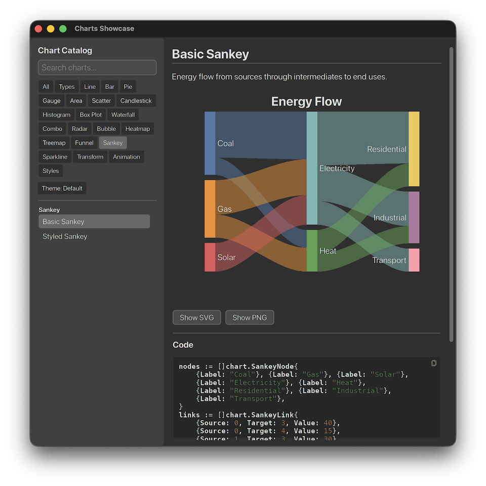

# Go-Charts

[](https://github.com/mike-ward/go-charts/actions/workflows/ci.yml)
[](https://go.dev)
[](LICENSE)

Charting library for Go, built on
[go-gui](https://github.com/mike-ward/go-gui). Immediate-mode rendering
via `DrawCanvas` — no virtual DOM, no diffing, just fast composable charts.



**[Browse the full chart gallery →](https://mike-ward.github.io/go-charts/)**

## Highlights

- 18+ chart types covering analytics, statistics, and finance
- Pure-Go rendering with retained tessellation cache; redraws are free
  when data is unchanged
- 16x MSAA PNG and SVG export — no window required
- Themeable: Tableau 10, Pastel, Vivid, and high-contrast accessibility
  palettes; customize colors, padding, legends, and tick styles
- Built-in data transforms: SMA/EMA/WMA, linear and polynomial
  regression, Bollinger bands, LTTB downsampling, binning
- CSV and JSON parsers for typed series
- Linear, Log, Time, and Category axes with auto-tick generation
- Zoom, pan, and brush select out of the box
- Zero external runtime dependencies beyond go-gui

## Quick Start

```go
package main

import (
    "github.com/mike-ward/go-charts/chart"
    "github.com/mike-ward/go-charts/series"
    "github.com/mike-ward/go-gui/gui"
    "github.com/mike-ward/go-gui/gui/backend"
)

func main() {
    gui.SetTheme(gui.ThemeDarkBordered)
    w := gui.NewWindow(gui.WindowCfg{
        Title:  "Line Chart",
        Width:  800,
        Height: 600,
        OnInit: func(w *gui.Window) { w.UpdateView(view) },
    })
    backend.Run(w)
}

func view(w *gui.Window) gui.View {
    return chart.Line(chart.LineCfg{
        ID: "demo",
        Series: []series.XY{
            series.NewXY(series.XYCfg{
                Name:  "Sales",
                Color: gui.Hex(0x4E79A7),
                Points: []series.Point{
                    {X: 1, Y: 10}, {X: 2, Y: 25},
                    {X: 3, Y: 18}, {X: 4, Y: 32},
                },
            }),
        },
    })
}
```

## Headless Export

Render any chart to PNG or SVG with no window or display:

```go
chart.ExportPNG(view, 960, 600, "chart.png")
chart.ExportSVG(view, 960, 600, "chart.svg")
```

## Showcase

Run the interactive showcase to browse 70+ live demos with source code:

```bash
go run ./examples/showcase
```

## Chart Types

| Type        | Function              | Type        | Function              |
|-------------|-----------------------|-------------|-----------------------|
| Line        | `chart.Line()`        | Box Plot    | `chart.BoxPlot()`     |
| Bar         | `chart.Bar()`         | Waterfall   | `chart.Waterfall()`   |
| Area        | `chart.Area()`        | Combo       | `chart.Combo()`       |
| Scatter     | `chart.Scatter()`     | Radar       | `chart.Radar()`       |
| Bubble      | `chart.Bubble()`      | Heatmap     | `chart.Heatmap()`     |
| Pie/Donut   | `chart.Pie()`         | Treemap     | `chart.Treemap()`     |
| Gauge       | `chart.Gauge()`       | Funnel      | `chart.Funnel()`      |
| Candlestick | `chart.Candlestick()` | Sankey      | `chart.Sankey()`      |
| Histogram   | `chart.Histogram()`   | Sparkline   | `chart.Sparkline()`   |

See [doc/ROADMAP.md](doc/ROADMAP.md) for planned features.

## Packages

| Package     | Description                                                           |
|-------------|-----------------------------------------------------------------------|
| `chart`     | Chart widgets and headless PNG/SVG export                             |
| `axis`      | Linear, Log, Time, and Category axes with auto-tick generation        |
| `series`    | Data types: XY, XYZ, Category, OHLC, Grid, TreeNode + CSV/JSON parsers |
| `scale`     | Data-to-pixel mapping: Linear, Log                                    |
| `theme`     | Color palettes and visual styling                                     |
| `transform` | Moving averages, regression, envelopes, LTTB, binning                 |
| `render`    | `DrawContext` adapter for chart primitives                            |

## Requirements

- Go 1.26+
- [go-gui](https://github.com/mike-ward/go-gui)
- SDL2 (for the interactive showcase; not required for headless export)

## Install

```bash
go get github.com/mike-ward/go-charts
```

## Build

```bash
go build ./...
go test ./...
go vet ./...
golangci-lint run ./...
```

## License

[PolyForm Noncommercial License 1.0.0](LICENSE)
