# Architecture

## Chart Generation Pipeline

```mermaid
%%{init: {"flowchart": {"wrappingWidth": 800, "padding": 20}} }%%
flowchart TD
    A["<b>User Code</b><br/>chart.Line(LineCfg{ Series, Title, ... })"] --> B

    B["<b>View Creation</b> &mdash; chart/line.go<br/>applyDefaults(), set theme/sizing<br/>return &lineView{cfg}"]:::pkg_chart --> C

    C["<b>Layout</b> &mdash; chart/line.go<br/>GenerateLayout(window)<br/>gui.DrawCanvas(OnDraw: lv.draw)<br/><i>retained tessellation cache:<br/>skip re-render when Version unchanged</i>"]:::pkg_chart --> D

    D{"OnDraw triggered"}:::decision --> E
    D --> H

    E["<b>Update Axes</b> (once per version change)"]:::pkg_chart --> E1

    subgraph axes ["Axis & Scale Setup"]
        E1["<b>Compute Bounds</b> &mdash; series/xy.go<br/>series.XY.Bounds()<br/>scan all points &rarr; minX, maxX, minY, maxY"]:::pkg_series --> E2
        E2["<b>Set Domain</b> &mdash; axis/linear.go<br/>axis.Linear.SetRange()<br/>&rarr; scale.Linear.SetDomain(min, max)"]:::pkg_axis --> E3
        E3["<b>Generate Ticks</b> &mdash; axis/tick.go<br/>GenerateNiceTicks() &rarr; 1/2/5 &times; 10&#8319;<br/>axis.Transform(value) &rarr; scale.Map() &rarr; pixel"]:::pkg_axis
    end

    E3 --> H

    subgraph draw ["Draw Pipeline &mdash; chart/line.go + render/"]
        direction LR
        H["1. Title &mdash; ctx.Text(...)"]:::pkg_render --> I["2. Grid &mdash; ctx.Line(...) for each tick"]:::pkg_render --> J["3. Axes &mdash; ctx.Line(left&rarr;right, top&rarr;bottom)"]:::pkg_render --> K["4. Tick Labels &mdash; ctx.Text(...) at tick positions"]:::pkg_render --> L["<b>5. Series Loop</b><br/>For each series: color = palette[i]<br/>Transform points via xAxis/yAxis<br/>Polyline, FilledCircle, FilledPolygon"]:::pkg_render --> M["6. Legend &mdash; drawLegend(ctx, entries)"]:::pkg_render
    end

    M --> N["<b>gui.DrawContext</b> (go-gui)<br/>Tessellate primitives &rarr; GPU vertex buffers &rarr; screen"]:::pkg_gui

    classDef pkg_chart fill:#e8f4fd,stroke:#2196F3,color:#000
    classDef pkg_series fill:#fff3e0,stroke:#FF9800,color:#000
    classDef pkg_axis fill:#f3e5f5,stroke:#9C27B0,color:#000
    classDef pkg_render fill:#e8f5e9,stroke:#4CAF50,color:#000
    classDef pkg_gui fill:#fce4ec,stroke:#E91E63,color:#000
    classDef decision fill:#fff9c4,stroke:#FBC02D,color:#000
```



## Core Transformation

The key operation is `scale.Linear.Map()` -- a linear interpolation
converting data values to pixel coordinates:

```
t     = (value - domainMin) / (domainMax - domainMin)   -> [0, 1]
pixel = pixelMin + t * (pixelMax - pixelMin)             -> screen position
```

The Y axis inverts `pixelMin`/`pixelMax` so that larger data values
map to smaller (higher) pixel positions.

## Package Responsibilities

| Package   | Role                                                |
|-----------|-----------------------------------------------------|
| `chart/`  | Orchestrates everything, implements `gui.View`      |
| `series/` | Holds raw data, computes bounds                     |
| `axis/`   | Generates human-readable ticks, delegates transforms|
| `scale/`  | Pure math: data-to-pixel mapping                    |
| `render/` | Thin wrapper over `gui.DrawContext` with helpers    |
| `theme/`  | Colors, palettes, text styles, padding              |

## Key Types

- **`chart.*Cfg`** -- config structs for each chart type
  (zero-initializable)
- **`axis.Axis`** -- interface: `Label()`, `Ticks()`, `Transform()`,
  `Inverse()`
- **`series.Series`** -- interface: `Name()`, `Len()`, `Color()`
- **`series.XY`** -- `[]Point` with `Bounds()` method
- **`scale.Scale`** -- interface: `Map()`, `Invert()`, `SetDomain()`,
  `Domain()`
- **`theme.Theme`** -- colors, text styles, palette, padding
- **`render.Context`** -- wraps `*gui.DrawContext`

## Pattern Notes

- All chart types follow go-gui `*Cfg` struct convention.
- Charts implement `gui.View` (`Content() []View`,
  `GenerateLayout(*Window) Layout`).
- `gui.DrawCanvas` provides retained tessellation: the `OnDraw`
  callback only fires when the chart's `Version` changes.
- Event callbacks: `func(*gui.Layout, *gui.Event, *gui.Window)`.
- Default sizing: `gui.FillFill`.
